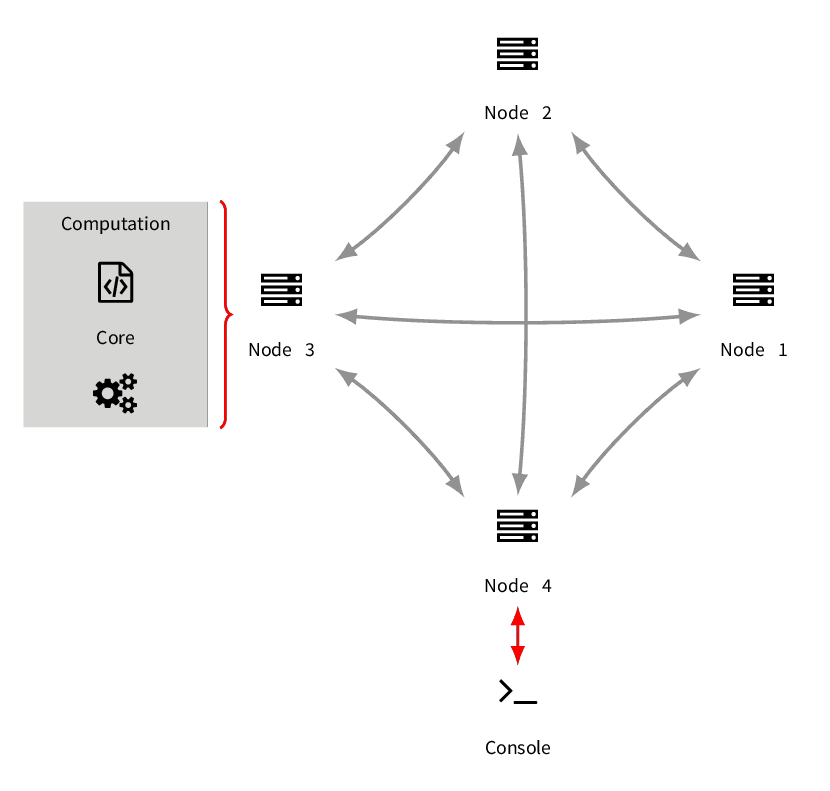

# Overview

AgE 3 is a rewrite of a distributed, multi-agent platform developed by [Intelligent Information Systems Group][iisg]
with a focus on providing a simple, modern and lightweight computational environment.

AgE has been firstly created as a platform tightly connected to the concept of [Evolutionary Multi Agent Systems][emas].
With the third version we decided to split the platform into two separate parts:

- **core** – which provide a distribution, parallelization and various services to the computation,
- **compute** – which is the part being executed as a computation by the core.

This separation greatly simplified both layers and made it possible to support other computational models.
AgE 3 is build with the focus on simplicity and extensibility.
It is possible to start creating its own *compute* module with a single class and then add more complicated logic and use more advanced services provided by *core*. 

## Architecture

AgE 3 is a distributed platform based on a *cluster* of *nodes*.
Each *node* is a separate JVM which can be run on a single or multiple hosts.
*Nodes* perform an automatic neighbourhood discovery and initialize a common, global state of the *cluster*.
They provide a unified view of resources for the *compute* level.

A *compute* module is a computation that can be run on AgE *cluster*.
In the most basic form, it is a single class implementing **Runnable** interface.
In more complicated scenarios it can be any collections of classes and dependencies which has a **Runnable** entry point.

AgE provides some means to control and inspect the state of the *cluster* and *computations*.
The basic one is the *console* that provides a Nashorn-based (JavaScript-based) command line interface.

[iisg]: https://iisg.agh.edu.pl/
[emas]: https://www.age.agh.edu.pl/agent-based-computing/emas-2/
